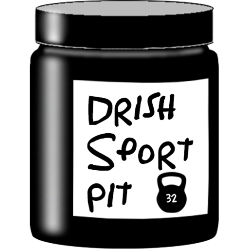

<h1> DrishSportPit</h1>

Наша команда рапределила роли таким образом:
- **Прокошин Николай Максимович** -  Дизайнер, Frontend-разработчик

- **Якушева Наталья Сергеевна** -	Backend-разработчик

- **Гнилицкий Константин Сергеевич** - Аналитик

- **Святохо Дмитрий Сергеевич** -	Frontend-разработчик

- **Савинкин Дмитрий Романович** - Специалист по тестированию

Нашим проектом стал магазин товаров, а именно магазин спортивного питания под названием <b>«DrishSportPit»</b>.

<h2>Аналитика :bar_chart:</h2>
...

<h2>Разработка дизайна :art:</h2>
Разработка дизайна началась 18 июня, тогда был разработан логотип магазина.
  

  

___

  <i>Логотип проекта</i>
  

 
На следующий день мы начали разрабатывать дизайн:
  

  

___

  <i>Первая версия главной страницы проекта</i>
  

  Следующие несколько дней разрабатывался остальной дизайн, а именно:
  - Вкладка «Каталога товаров»
  - Страница товара, в колилистве двух штук
  - Корзина, пустая и наполненная товарами
  - Личный кабинет пользователя
  - Страница с ошибкой

Чтобы посмотреть на итоговый результат можете перейти на проект <a href ="https://www.figma.com/design/ZumUZ8boM4ANNOZOvuoQKp/DESIGN?t=3wjoTr2HRGATSLLU-1">Figma.</a>

<h2>Frontend-разработка :computer:</h2>
Разработка Frontend-части проекта началась 19 июня. В этот день были сделаны первые наброски.
  

  

___

  <i>Первая версия главной страницы проекта в Frontend-разработке</i>
  

<h2>Backend-разработка :earth_americas:</h2>
...
